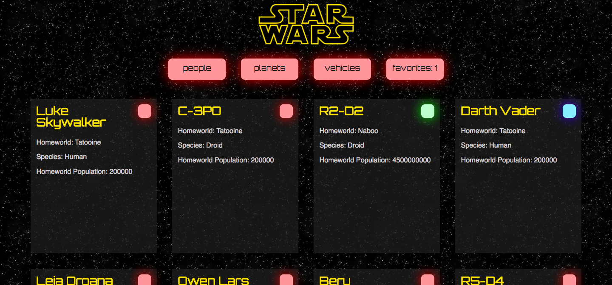

 # SWAPI Box
 
 ## About: 
SWAPI Box is a school project from Turing School of Software and Design. This project utilzes the StarWars API in order to display cards.

## Learning Goals: 

* Handle nested API's
* Learning more about React
* Learn how to test API calls

## Tech Stack: 

* JavaScript
* React
* JSX
* CSS
* Chai
* Enzyme
 
 ## Set Up

1. Clone the repo
2. `npm install`
3. To run in browser: `npm start`
4. To run tests: `npm test`
 
 
## Screen Shot: 

